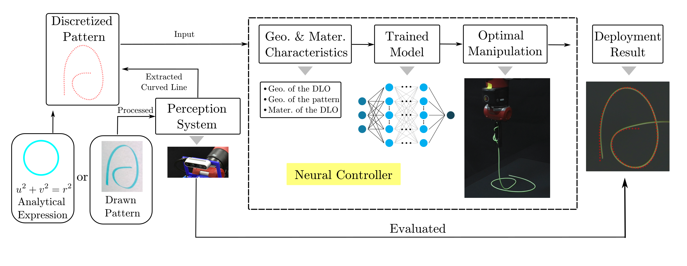
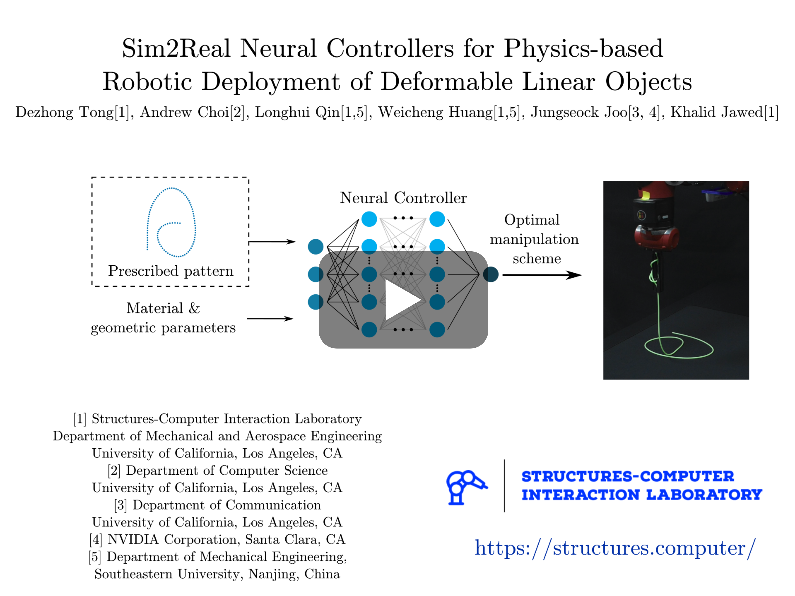
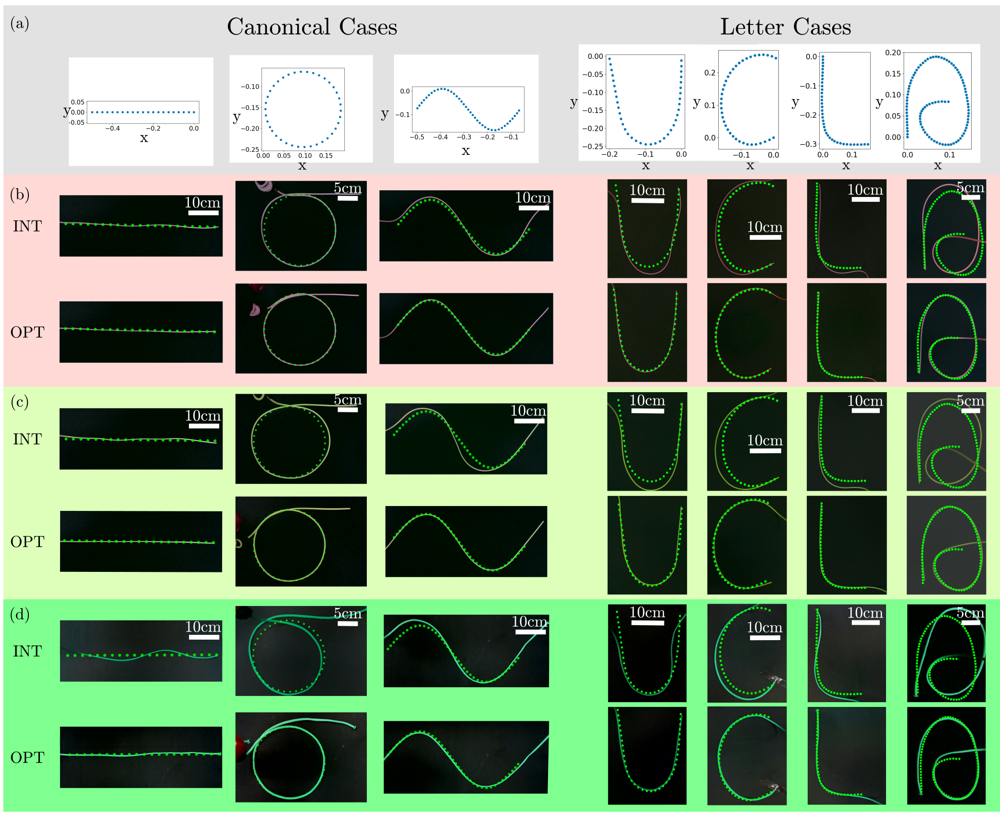
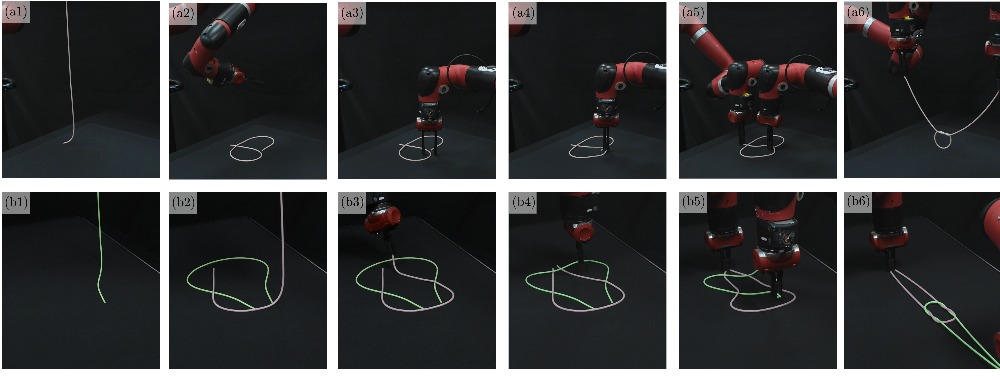

## Sim2Real Neural Controllers for Physics-based Robotic Deployment of Deformable Linear Objects

---
<p align="center">

<br>
<em> A Full End-to-end Sim2Real Nerual Controller for Deployment Tasks </em>
</p>


This repository contains a numeric solver based on physically accurate simulation and a trained neural network solver for generating any optimal robot trajectory for deploying a deformable linear object (DLO) along any feasible patterns on a rigid substrate.

The algorithm inputs the pattern's geometry and DLO's geometric and material parameters. We offer some examples under the pattern folder for tests.

Below is a video showcasing different deployment results and its applications.

[](https://www.youtube.com/watch?v=2tkmbd6oDPw)

---

### Instructions

All code has been developed and tested on Python 3.10. Please install the following dependencies.
```
numpy
scipy
matplotlib
pickle
torch
```

Afterwards, compile functions using the shell script as shown below.
```bash
mkdir build && cd build
cmake ..
make
```

Once all installation steps have been finished, run ``main.py`` through the provided python script as shown below.
The input arguments for ``main.py`` includes: (1) using intutive scheme (true) or not (false), (2) using neural network solver (NN) or numeric solver (numeric), (3) the filename stored the prescribed pattern under folder ``pattern``
```bash
python3 main.py false NN patternA.txt
```

---

Below are some deployment results with various DLOs.

<p align="center">


<br>
<em> Fig. 2 Deployment results for various patterns and the application of DLO deployment in knot tying.</em>
</p>

***

### Citation
If our work has helped your research, please cite the following manuscript.
```
@Article{tong2023sim2real,
  title={Sim2Real Physically Informed Neural Controllers for Robotic Deployment of Deformable Linear Objects},
  author={Tong, Dezhong and Choi, Andrew and Qin, Longhui and Huang, Weicheng and Joo, Jungseock and Jawed, M Khalid},
  journal={arXiv preprint arXiv:2303.02574},
  year={2023}
}
```
